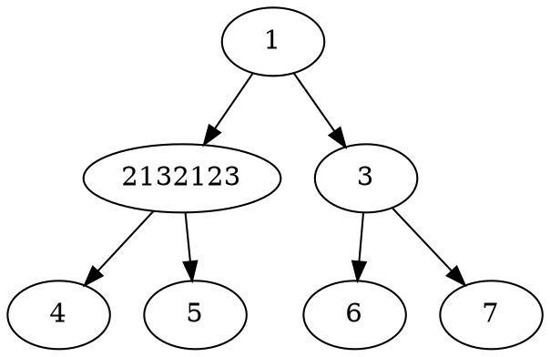

---
tags:
  - 演示1
  - markdown
---
111233
# hello vitepress blog11111123ff

[参考](https://vitepress.vuejs.org/guide/markdown)

## 扩展语法1123123

### 指定封面图

```md
---
coverImg: xxx
---
```

### 置顶1123fsad123ff123

```md
---
top: true
---
```

### 添加 tag

```md
---
tags:
  - 随笔
---
```


### [markdown-it-sub](https://github.com/markdown-it/markdown-it-sub)

C~7~H~14~O~2~

### [markdown-it-sup](https://github.com/markdown-it/markdown-it-sup)

Friday the 13^th^

### [markdown-it-task-lists](https://github.com/revin/markdown-it-task-lists)

- [ ] Homework
- [x] Procrastinating

### 数学公式

多行公式块：

$$
rac{1}{
  Bigl(sqrt{phi sqrt{5}}-phiBigr) e^{
  rac25 pi}} = 1+rac{e^{-2pi}} {1+rac{e^{-4pi}} {
    1+rac{e^{-6pi}}
    {1+rac{e^{-8pi}}{1+cdots}}
  }
}


$$

行内公式：

公式 $a^2 + b^2 = color{red}c^2$ 是行内。

### UML





### 脚注

这里是一个脚注引用[^1]，这里是另一个脚注引用[^bignote]。

```text
这里是一个脚注引用[^1]，这里是另一个脚注引用[^bignote]。
[^1]: 第一个脚注定义。
[^bignote]: 脚注定义可使用多段内容。

    缩进对齐的段落包含在这个脚注定义内。

    ```
    可以使用代码块。
    ```

    还有其他行级排版语法，比如**加粗**和[链接](https://b3log.org)。
```

[^1]: 第一个脚注定义。
[^bignote]:
    脚注定义可使用多段内容。
    缩进对齐的段落包含在这个脚注定义内。

    ```text
    可以使用代码块。
    ```

    还有其他行级排版语法，比如**加粗**和[链接](https://b3log.org)。